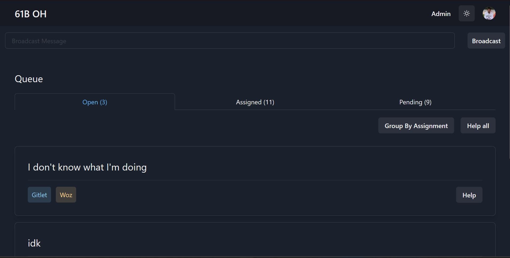
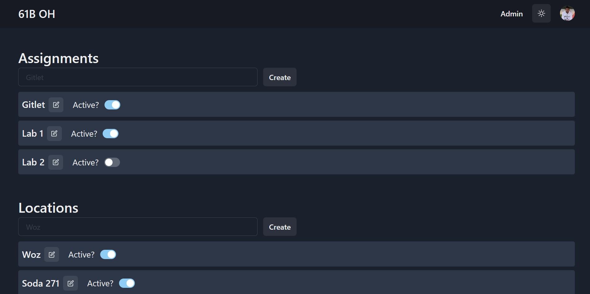
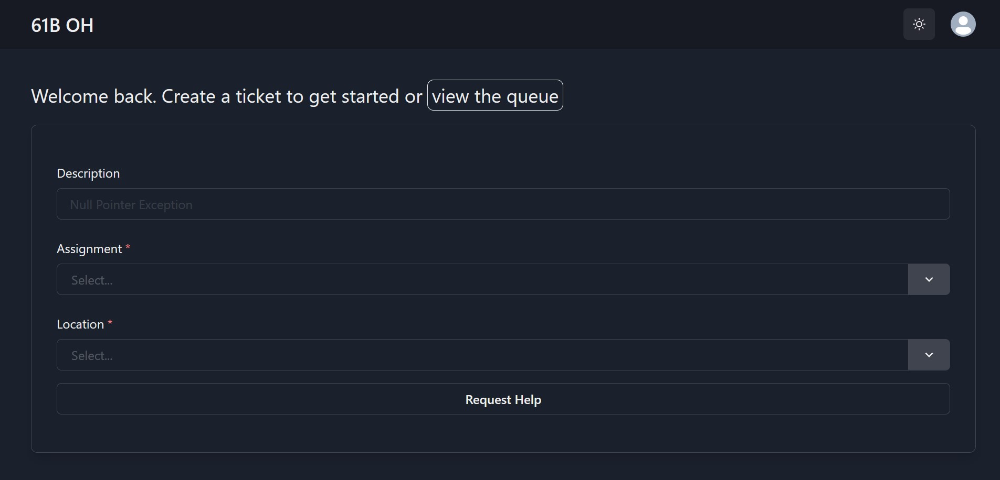

# Simple Office Hours Queue

## What?

SOHQ is an open-source office hours queue that allows students to sign up for office hours and instructors to manage the queue.

Instructor:

Admin:

Student:

## Installation
TODO: Write installation instructions for Ably, GoogleAuth, and Database .env setup

## Tech Stack

This project is built using the [T3 stack](https://github.com/t3-oss/create-t3-app), specifically these aspects:
- [Next-Auth.js](https://next-auth.js.org) for authentication (Google)
- [Prisma](https://prisma.io) for database management
- [tRPC](https://trpc.io) for API management
- [Chakra UI](https://chakra-ui.com) for UI components
- [MySQL](https://mysql.com) for database
- [Ably](https://ably.com) for real-time updates

## Contributing
TODO